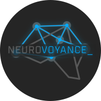

<h1>NeuroVoyance</h1>

<h2>NeuroVoyance: Advancing AI Through Decentralization</h2>

<h3>Overview</h3>

NeuroVoyance is an innovative approach to AI development that embraces decentralization as a means to complement and enhance the existing AI ecosystem. In this README, we discuss the benefits of decentralization and how NeuroVoyance contributes to this evolving landscape.

<h3>Decentralization: A Collaborative Approach</h3>

In recent years, there has been a growing interest in the potential of decentralized models for AI development. These models offer an alternative approach that complements centralized systems, contributing to greater accessibility for people around the world, including small companies. It's important to highlight that decentralization should not be seen as a replacement or threat to the achievements of corporations in the field. Instead, it serves as an additional avenue to enhance AI accessibility and foster a sense of community-driven progress.

<h3>Complementing Centralized Models</h3>

Decentralized AI models should be seen as valuable companions to centralized solutions rather than competitors. Corporations have played a significant role in advancing AI technologies, and we acknowledge the contributions they have made. Without their innovations, many groundbreaking projects, like the LLAMA project or the Transformers library, might not have come into existence. NeuroVoyance embraces this collaborative spirit to enrich the AI landscape.

<h3>The Power of Open Source</h3>

One of the core principles of the decentralized AI approach, as exemplified by NeuroVoyance, is the commitment to open source collaboration. By embracing open source practices, NeuroVoyance aims to create a community-driven model where the benefits are shared among users and contributors. This collaborative spirit ensures that AI development remains transparent, inclusive, and accessible to a broader audience, avoiding the concentration of rewards in the hands of a few.

<h3>Building a Stronger Future</h3>

Decentralization in AI is not about dismantling existing structures but about enriching the AI landscape with diversity, collaboration, and inclusivity, as seen through the lens of NeuroVoyance. The goal is to empower individuals, small companies, and innovators to participate actively in shaping the AI future. In this way, we can collectively learn from the past and steer clear of potential controversies or pitfalls associated with centralized models.

<h3>Structure</h3>

<h3>Conclusion</h3>

NeuroVoyance, along with the broader decentralization movement, offers an exciting opportunity to build a more inclusive, community-driven, and transparent future in AI. It is a valuable addition to the AI ecosystem that complements the incredible advancements achieved by corporations. By working together and embracing open source principles, as demonstrated by NeuroVoyance, we can ensure that the benefits of AI reach a broader audience, fostering innovation and positive change in the AI landscape.

For more information and to get involved, visit the [NeuroVoyance GitHub repository](https://github.com/ParisNeo/NeuroVoyance).
